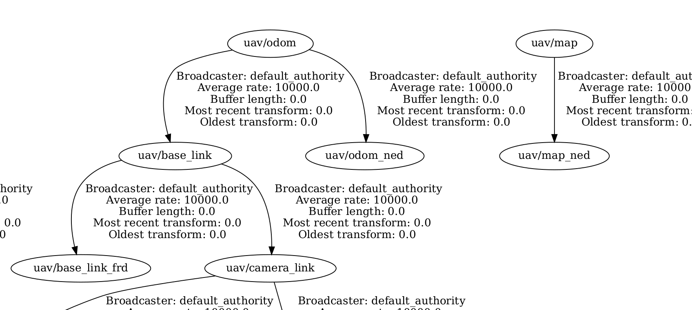

# Drone Bringup
Class for ROS2 node that republish the odometry from the 
GZ simulator into the PX4 vehicle odometry in emulating a 
visual inertial odometry system. Additionally it publishes
tf transformation between odom_ned and base_link_frd.

## TF tree
This package has to be inteded as startup module for a simulation which goal is the 
development of a navigation stack for an UAV in GPS-denied environment. To do that,
the standard TF tree for navigation is implemented:

## TODO: explain about TF tree construction
